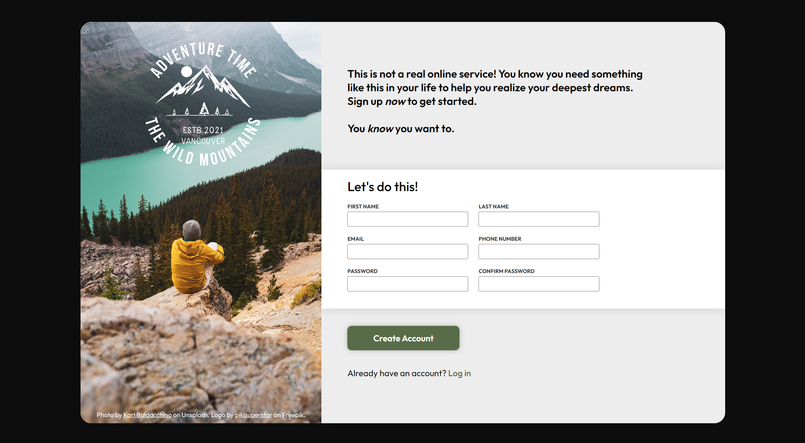

# odin-sign-up-form
A Sign-up form that emphasizes frontend design with HTML Forms, Input Validation, and CSS Pseudo Class selectors to practice intermediate HTML/CSS.

This project served as an introductory project to semantically layout & style HTML `<form>` elements, together with their respective `<label>` and `<input>` tags. There are no `action` and `method` attributes because I have yet to learn about linking my frontend to a backend server.

I tried to layout small portions of HTML and styling them with CSS, but that was not as efficient as I thought it would be. I ended up having to do a deep dig in my stylesheet when I forgot to add the `<form>` tag - resulting in a broken layout. Next time, I'll focus on semantic HTML design before proceeding with CSS layout & styling.

My favorite code snippet I plan to use again is the `box-shadow` clipping CSS property: `clip-path: inset(-15px 0px -15px 0px); /* clip horizontal box shadow */`, which allows a container to clip any overflows set by the programmer (or pesky unneeded shadows in my case).

The part that I had the most fun with was designing the password confirm validation using DOM Manipulation. It adds a lot of coupling & overhead, so I hope I can find a better method to do it.

```JavaScript
// if the values of the password fields are not the same, set a custom attribute "isvalid" to false, and vice-versa
passwordField.addEventListener('keyup', () => {
    if (passwordField.value != passwordConfirmField.value) {
        passwordField.setAttribute('isvalid', 'false');
        passwordConfirmField.setAttribute('isvalid', 'false');
        passwordWarningText.style.display = 'block';
    }
    else if (passwordField.value == passwordConfirmField.value) {
        passwordField.setAttribute('isvalid', 'true');
        passwordConfirmField.setAttribute('isvalid', 'true');
        passwordWarningText.style.display = 'none';
    }
})
```

Since we cannot trigger an `<input>` tag to be invalid using JavaScript directly (like some sort of Boolean Attribute like `required`), I had to make a Custom Attribute called `isvalid` and treated it like a boolean for my CSS Attribute Selectors.

```CSS
input[isvalid="false"],
input:invalid {
  outline: hsl(0, 0%, 100%);
  border: 2px solid #d06969;
  border-radius: 4px;
}
```

I need to improve on:
- semantic & accessible HTML tag hierarchy architecture
- percentage-based values, especially for containers withiin containers
- pseudoclass CSS selectors without needing to Google for answers
- mobile-first responsive design (my webpage totally breaks on other resolutions)

# Output
### [Visit the Website Here](https://luzefiru.github.io/odin-sign-up-form/)


# Requirements
These were the requirements in The Odin Project's [Project: Sign-up Form](https://www.theodinproject.com/lessons/node-path-intermediate-html-and-css-sign-up-form) site to serve as a guide for functionality. Other aesthetic choices and implementations solely depend on the programmer.

